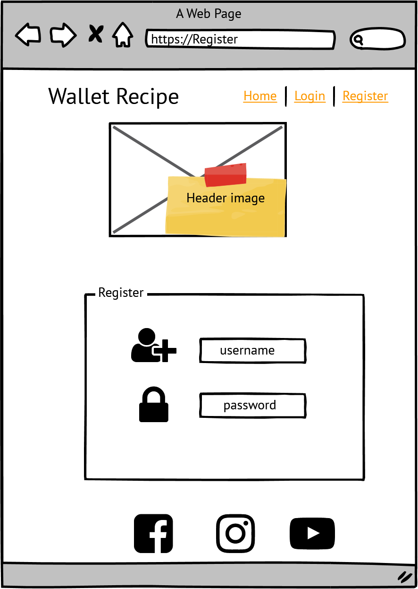
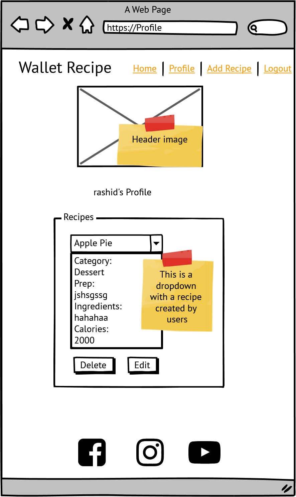
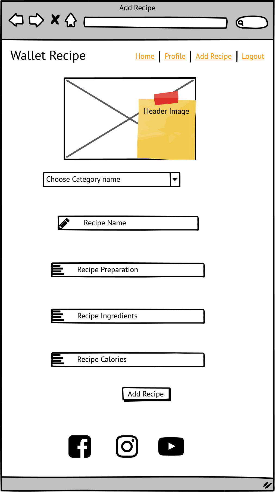
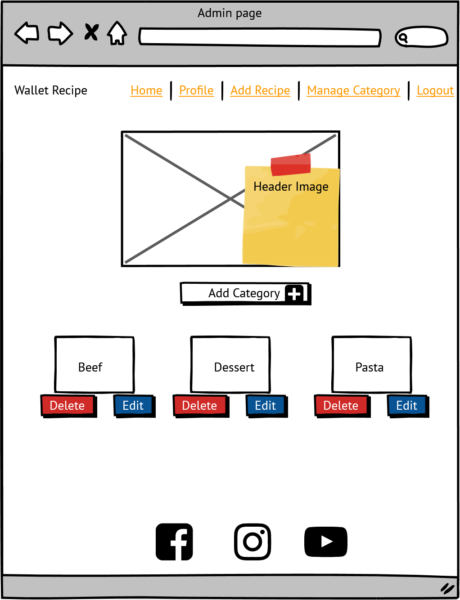

# Web and Mobile Recipe app. 

## Introduction

Welcome to my third milestone project. This project is a recipe web and mobile app that involves programming languages such as HTML5, CSS3, JavaScript and Python.
This app is called "WALLET RECIPE" and is suppose to demonstrate how all the above languages are used to showcase their excellence in delivering good product to the user from backend to frontend.

A live website can be found [here](https://flask-cusine3.herokuapp.com/).

# Table of Contents

-   [1. UX](#ux)
    -   [1.1. Strategy](#strategy)
        -   [Project Goals](#project-goals)
            -   [User Goals:](#user-goals)
            -   [User Expectations:](#user-expectations)
            -   [Trends of Modern Websites](#trends-of-modern-websites)
    -   [1.2. Structure](#structure)
    -   [1.3. Skeleton](#skeleton)
    -   [1.4. Surface](#surface)
-   [2. Features](#features)
-   [3. Technologies Used](#technologies-used)
-   [4. Testing](#testing)
-   [5. Development Cycle](#development-cycle)
-   [6. Deployment](#deployment)
-   [7. End Product](#end-product)
-   [8. Known Bugs](#known-bugs)
-   [9. Credits](#credits)

# 1. UX

[Go to the top](#table-of-contents)

We all have that one part of ourselves that is drawned in food specialities even though not all of us are foodies but deep down us food motivates us in all kinds of ways.
The app has simple and navigable features to all users and non users.

## 1.1. Strategy

[Go to the top](#table-of-contents)

### Project Goals

The goal of this app is to not just target those in need of the recipes to make their quick dinner but it allows users to share their own personal dishes with others.
The app gives a registered user full potetial to create,update and delete the recipe whenever they please with less complications.
The app acts as storage of personal recipes or sharing to the users.

### User Goals:

First Time Visitor Goals
-   As a first-time visitor, I want to be engaged with the concept of the app.
-   As a first-time visitor, I want to be able to easily understand what the app is about.
-   As a first-time visitor, I want to see what others have shared.
-    As a first-time visitor, I want to have less complication on registering.

Returning Visitor Goals
-   As a Returning Visitor, I want toedit and delete the data I created.
-   As a Returning Visitor, I want to share more recipes with other users.
-    As a Returning Visitor, I want to update my archived data/recipes

Frequent User Goals
-   As a Frequent User, I want to check to see if there are any newly updates on the categories.
-   As a Frequent User, I want to check if more recipes are added or updated by users.

### User Expectations:

The app should be secure on the eyes of the user displaying their own login profile and allowing added content to be named afer the creator/user.

-   The app about content is briefly explained clear.
-   The user interface is easy to navigate.
-   The app is responsive on all devices including mobile, tablet and desktop.
-   To have the ability to create, update and delete the contents loaded accordingly.

### Trends of modern app:

-   Mobile app (usage on the go)
-   Visuals that are easy on the eyes

## Scope

 I will phase this project in multiple phases. Phase 1 will be what I have identified as a minimum viable product. Please find below the plans I have for each phase.

### Phase 1

-   Engaging the app contents
-   Register form for new users
-   login form for registered users
-   The ability to add the recipe
-   The ability to edit delete and update a recipe
-   The ability to edit delete and update a category
-   Responsive design
-   Confirm delete popup modal for both cusine and category
-   Display the created cusine on the landing page

### Phase 2

-   A register form for new users to have a access to the app's features.
-   A login form for the registered users.

## 1.2. Structure

[Go to the top](#table-of-contents)

It is really important to include responsive design in this project as many users are using different devices (mobile, tablet, laptop/PC). This gives the user the best experience on their device.

-   Responsive on all device sizes
-   Easy navigation through labelled buttons
-   Footer at the bottom of the index page that links to the social media website.
-   All elements will be consistent including font size, font family, colour scheme.

## 1.3. Skeleton

[Go to the top](#table-of-contents)

I used [Balsamiq](https://balsamiq.com/) to create my wireframes as this gives the template of the UI. This also shows where all elements will be placed within the screen.

There are versions of the overall design of the project with the wireframe as the first one shows the design on both web and mobile browser with a landing page displaying the navbar the recipes/cusines created by created by the admin in the main three dish categories, this responds to all screen displays, second one shows the register form that displays when the user wants to register.The third one shows the profile of the login in user that displays the user created recipes/cusine from all the active users except a user access to their own cusines in terms of editing and updating them or deleting.The fourth one shows the add cusine content where the user attempts to create their new cusine. The fifth one are clickable elements/buttons found on the ready made cusines by the user and when clicked it redirects the user to what it is labeled to do. The fith one shows the added categories by user "manage categories" page, sixth shows the add new category content for the admin of the app. 

### Wire-frames

Web browser cusines page (When the home page is accessed by both mobile and larg device):
[

Web browser  page (When the register page is accessed):
[

Web browser page(When the user is registered and loged in):
[

Web browser page(When the add recipe page is accessed in):
[

Web browser page(When the navbar is accessed in small display):
[

Web browser page(When the Admin is loged in and accessing the manage category page):
[

## 1.4. Surface

[Go to the top](#table-of-contents)

### Colours

The colors for the buttons and scroll down menu are generated from [here](https://materializecss.com/navbar.html).

### Typography

I decided to use Roboto as my font of choice with sans serif as my backup font for browsers that might not support Roboto.

# 2. Features

[Go to the top](#table-of-contents)

### All Pages

-   The navbar is placed at the top of the page.
-   Header background image is an image to represent the app as a recipe app to the first time
users before they read details about the app.
-   plain background - to give more of a user experience by offering more focus to the features on the app.
-   A few number of jumbled recipes on the home page to showcase the app is about, created by the admin.

### Landing Page

-   Home page header image that explains to a user that the app is about food.
-   Navigation bar/menu contains the clickable elements which are linked to the targeted contents for the user.
-   The about content is a little introductory part of the app for the new users which explains in words what they should expect and do if they would be interested in the app.
-   The cusines/recipes below the "About" content are to showcase the first time user what the app is about in practicality.

-   Footer - The footer is placed at the bottom of this page. This contains all social media links that open up in a new tab.

### register Page

-   Contains a form to be inserted data of the user to be submitted and verified as a regular user.

### login Page

-   Contains a form to be inserted data of the user to be login as a regular user.

### Profile Page

-   Contains the cusines created by other users that can be viewed by registered users but only the creater can edit and delete them.

### Add Recipe Page
-   Contains a form with data that has labeled inputs to be filled by the user optionally.
-   The add cusine button at the bottom that confirms the entered data by the user being valid data.

### Manage categories Page
-   Can only be accessed by the admin of the app and it has the added categories and the button option for adding a new category.
-   Categories contain edit and delete button vissible to only the admin being logedin which allows the admin to update or delete the category chossen.

-   Delete confirmation modal is triggered both when user and admin decide to delete an item giving them a chance to either cancel or confirm deletion.

## 3. Technologies Used

[Go to the top](#table-of-contents)

-   [HTML5](https://en.wikipedia.org/wiki/HTML)
    -   The project uses HyperText Markup Language.
-   [CSS3](https://en.wikipedia.org/wiki/CSS)
-   [MaterializeCSS](https://en.wikipedia.org/wiki/MaterializeCSS)
    -   The project uses MaterializeCSS.
    -   The project uses Cascading Style Sheets.
-   [JavaScript](https://en.wikipedia.org/wiki/JavaScript)
    -   The project uses JavaScript.
-    [JQuery](https://en.wikipedia.org/wiki/JQuery)
    -   The project uses JQuery.
-   [Python](https://en.wikipedia.org/wiki/Python)
    -   The project uses Python to render templates and load the data from the database and the json file. 
-    [MongoDB](https://en.wikipedia.org/wiki/MongoDB)
    -   The project uses MongoDB to store, retrieve data for the user.
-    [Flask](https://en.wikipedia.org/wiki/Flask)
    -   The project uses Flask.   
-   [Visual Studio Code](https://code.visualstudio.com/)
    -   The project uses Visual Studio Code.
-   [Chrome](https://www.google.com/intl/en_uk/chrome/)
    -   The project uses Chrome to debug and test the source code using HTML5.
-   [Balsamiq](https://balsamiq.com/)
    -   Balsamiq was used to create the wireframes during the design process.
-   [GitHub](https://github.com/)
    -   GitHub was used to store the project's code after being pushed from Git.
-   [Heroku](https://heroku.com/)
    -   heroku was used to launch the project / app.

# 4. Testing

[Go to the top](#table-of-contents)

### Google Developer Tools

For every element that I added to my HTML, I would add the basic CSS to my stylesheet. I would then use the inspect element to try different styles. Once I've got it to my liking I would copy the CSS from google into my stylesheet. This allows me to keep track of the code I am using.

For all JavaScript functions, i console logged each function to make sure that the output was correct.

### Responsive Tools

I used [Am I Responsive](http://ami.responsivedesign.is/) to make sure that all my pages are responsive to all devices.

### W3C Validator Tools

I used [W3C Markup](https://validator.w3.org/#validate_by_input+with_options) to check for any errors within my HTML pages.
I had no errors in the index and othe pages.

![index HTML validator]
![start_game HTML validator]

I used [W3C CSS Validation](https://jigsaw.w3.org/css-validator/) to check for any errors within my CSS stylesheet.
I had no errors in my CSS file.

I used [JS Hint](https://jshint.com/) to check for any errors within my JavaScript file.
I had no errors in my JavaScript files.

## Manual Testing

I have tested my site on firefox and google chrome on multiple devices.
I also used [JS Fiddle](https://jsfiddle.net/) as a playground to test all of my code before staging and committing any changes.

These include:

-   iPhone X
-   iPhone XS Max
-   iPad Pro
-   Macbook Pro

Please find below my testing process for all pages via mobile and web:

### All Pages

-   Header Image background - I tested this on Chrome and firefox on all devices.

    -   Text:

        -   I checked that all text is in the correct and consistent size and font. I also checked that there were no typos.

    -   Media:

        -   I checked that all images on this page-load. Making sure that all images have alt text if media does not load. It worked as expected.

    -   Responsiveness:
        -   I checked that all pages and elements were responsive. Checking each page on mobile and website and adjusting screen size to find breakpoints. It worked as expected.

### Landing Page

-   Navigation menu bar - functions as expected.

    -   The created cusines by admin to show off the cusin example. This worked as expected.
    
-   Footer

    -   Facebook - When selecting the Facebook icon, a new tab opens and redirects to the Facebook website. It worked as expected.
    -   YouTube - When selecting the YouTube icon, a new tab opens and redirects to the YouTube website. It worked as expected.
    -   Instagram - When selecting the Instagram icon, a new tab opens and redirects to the Instagram website. It worked as expected.

### Register Page

-   The form response properly, all the input fields react as expected and user is able to submit their data and get verified as expected.

### Login Page
-   The form response properly, all the input fields react as expected and user is able to submit their data and get loged in their profile as expected

### Profile Page
-   The page loads the contents that was expected to run and displays the user's loged in name.
-   The buttons to edit and delete cusines response respectively.
-   The delete button triggers a pop up modal for delete confirmation as expected.
-   The edit cusine form responds as programmed hence the page responded as expected

### Add Recipe Page
-   The form for collecting data response respectively.
-   The submit recipe button funtions as well and all worked as expected

### Manage Category Page
-   The page loads as expected and displays the content expected.
-   Each category has an edit and delete function where they both respond as expected.
-  The add category button responded as expected hence the page responded respectively. 

# 5. Development Cycle

[Go to the top](#table-of-contents)

There were some elements I changed, re-positioned and added from my original wireframes as they were more visually appealing.

### Landing Page

-   The first idea was changed to simply convey a brief and clear image to a first user who visits the app inorder.
-   The current landing page has the "About" content which briefs the user about the app, the four recipes added by the admin to trap the users attention.

### The profile page
-   The page has the users created recipes and loads other users recipes too, this is intended to motivate the user to create a recipe by looking at what the other users have created.

### The register page
-   The page has a brief form which convinces the user their data safety without asking email or pone number for profile verification.

# 6. Deployment

[Go to the top](#table-of-contents)

I used the terminal to deploy my project locally. To do this I had to:
1. Create a repository on GitHub.
2. Clone the repository on your chosen source code editor (Visual Studio Code in my case) using the clone link.
3. Open the terminal within Visual Studio Code.
4. Enter "python3 -m http.server" into the terminal.
5. Go to "http://[::]:8000/" on my web browser.
6. All locally saved changes will show up here.

I used GitHub pages to deploy my final project to the cloud. To do this I had to:

1. Create a repository on GitHub.
2. Clone the repository on your chosen source code editor (Visual Studio Code in my case) using the clone link.
3. Add files to Git (staging area) and use the Visual Studio Code to commit changes.
4. Use the terminal within Visual Studio Code to push the code.
5. Go to GitHub and load your repository.
6. Select settings.
7. Select pages on the left menu bar.
8. Click on the master branch.
9. This will now generate a link with your website live.

# 7. End Product

[Go to the top](#table-of-contents)

Please fine below a screenshot of each page:

Home page web UI:

Home page mobile UI:

start game page web UI:

Start game page mobile:

Level option page mobile:

Match page preview:

Won page:

Losing page :

# 8. Known Bugs

[Go to the top](#table-of-contents)

-   The header image was loading on the app but it was throwing the error notification on the code that was saying the indetation was wrong and I asked on one of the slack community group "Ask us anything" and "Eventyret_mentor" gave me a simple but yet functioning solution to just write a path directory instead of using jinja form of linking data.  

-   The ingredient's input field wasn't responsive as expected but after looking through the code,there was a miswritten code of description instead of ingredients .

-   The get cusine funtion wasn't loading with heroku even after the template's name was changed a couple of time and that was because the project needed to be deployed after every new change on pushed and committed.

# 9. Credits
- I would like to thank my mentor Marcel who has been on the front line by offering me full support on this project, he has been encouraging and appreciative to the little I knew on my project and that increased my passion on playing around with javascript functions.
-Sean from tutor support for some guidelines through the shaping of the project.

[Go to the top](#table-of-contents)

### Code

-   The popup modals come from [JS Fiddle](https://jsfiddle.net/kumarmuthaliar/GG9Sa/1/)
-   The idea used on the project came from the code institute's Backend Development mini project

### Content

-   All images found on the app came from [Pixabay Images](https://pixabay.com/)
-   All weapon icons came from [Font Awesome](https://fontawesome.com/v5.15/icons?d=gallery&p=2)

